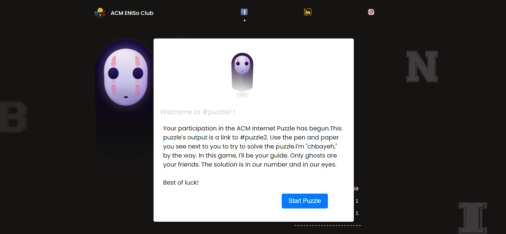

 # Chbayeh's Coding Puzzle Game

Welcome to Chbayeh's Coding Puzzle Game, a fun and mysterious way to solve coding problems! This game was created to encourage Eniso freshman students to improve their coding skills in a fun and engaging way. In this game, you'll follow the story of Chbaih the ghost as he guides you through 5 challenging puzzles that will test your coding abilities. Once you've completed all 5 puzzles, you'll unlock a final puzzle based on Chbayeh's stories.

## How to Play
To play the game, simply follow these steps:

1. Clone the repository to your local machine
2. Open index.html in your web browser
3. Read the instructions on the homepage
4. Solve each puzzle one by one, with the help of Chbaih
5. Complete all five puzzles to unlock the final challenge

## Features
- Fun and challenging puzzles that test your coding skills
- A mysterious and engaging storyline with the help of Chbaih the ghost
- Easy to play with a user-friendly interface
- Written in HTML, CSS, and JavaScript
- Responsive design that works on desktop and mobile devices

## Screenshots

Here are some screenshots of the game in action:

## Contributing

If you'd like to contribute to Chbaih's Coding Puzzle Game, please fork the repository and create a pull request with your changes. We welcome contributions of all kinds, including bug fixes, new puzzles, and improvements to the game's design and functionality.

